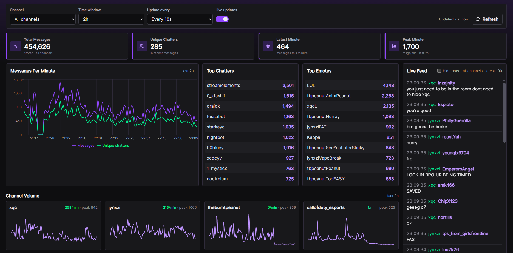

# Twitch Analyze 🎮

Twitch Analyze is a realtime Twitch chat analytics app. It ingests live chat, stores events for historical queries, and displays channel activity in a React dashboard.

## What It Does ✨

- 📡 Reads Twitch chat through IRC or EventSub.
- 🧱 Streams messages through Kafka.
- ⚡ Stores analytics data in ClickHouse.
- 📊 Shows live and historical chat metrics in a React UI.
- 🤖 Can generate chat summaries and stream transcripts when OpenAI features are enabled.
- 🚀 Includes Docker Compose, local Kubernetes manifests, and Terraform notes for deployment practice.

## Stack 🛠️

- Backend: FastAPI, Pydantic, async Python
- Frontend: React, TypeScript, Vite
- Streaming: Kafka
- Storage: ClickHouse
- Monitoring: Prometheus and Grafana
- Deployment practice: Docker Compose, Kubernetes, Terraform on GCP

## Quick Start 🚦

```bash
cp .env.example .env
docker compose up --build
```

Then open:

- Dashboard: http://localhost:5173
- API docs: http://localhost:8000/docs
- Kafka Console: http://localhost:8080
- Grafana: http://localhost:3000

Set `TWITCH_CHANNELS` in `.env` to start ingesting live chat. The default IRC mode can read public chat without Twitch credentials.

## Useful Commands 🧪

```bash
cd backend && PYTHONPATH=. pytest
cd frontend && npm run build
docker compose config --quiet
```

Script-based startup is also available:

```bash
.venv/bin/python scripts/start.py all
```

## Project Map 🗺️

- `backend/app`: API routes, ingestion clients, storage integrations, workers, and services
- `backend/tests`: backend regression tests
- `frontend/src`: React app, components, hooks, API client, and shared types
- `sql`: ClickHouse schema
- `monitoring`: Prometheus and Grafana configuration
- `k8s/local`: local Kubernetes practice manifests
- `infra/gcp/terraform`: GCP Terraform experiment
- `docs`: architecture, deployment, troubleshooting, and feature notes

## Docs 📚

- [Architecture notes](docs/architecture-notes.md)
- [Project flow](docs/project-flow.md)
- [AWS deployment](docs/aws-deployment.md)
- [GCP Terraform deployment](docs/gcp-terraform-deployment.md)
- [LLM summary flow](docs/llm-summary-flow.md)
- [Troubleshooting log](docs/troubleshooting-log.md)
