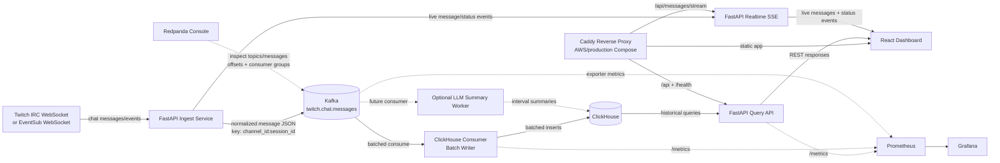
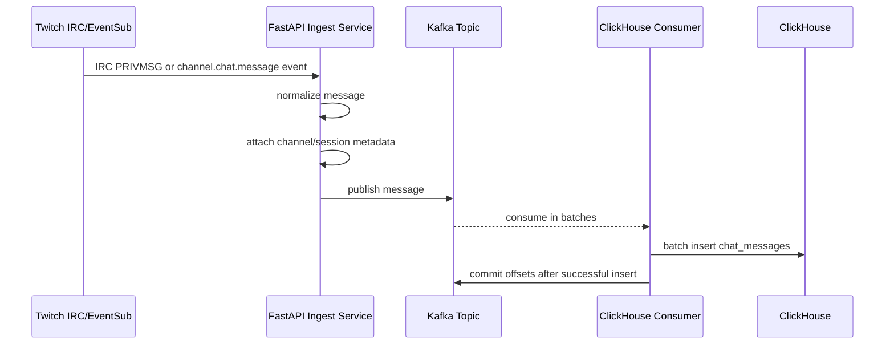
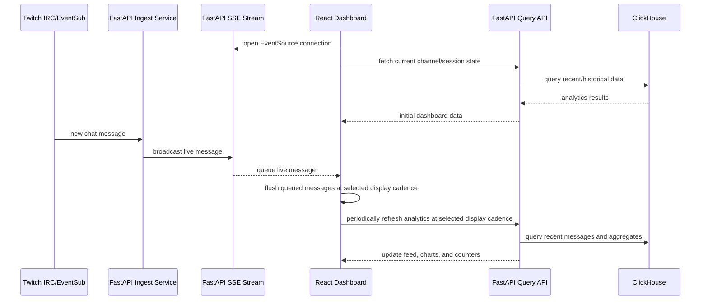
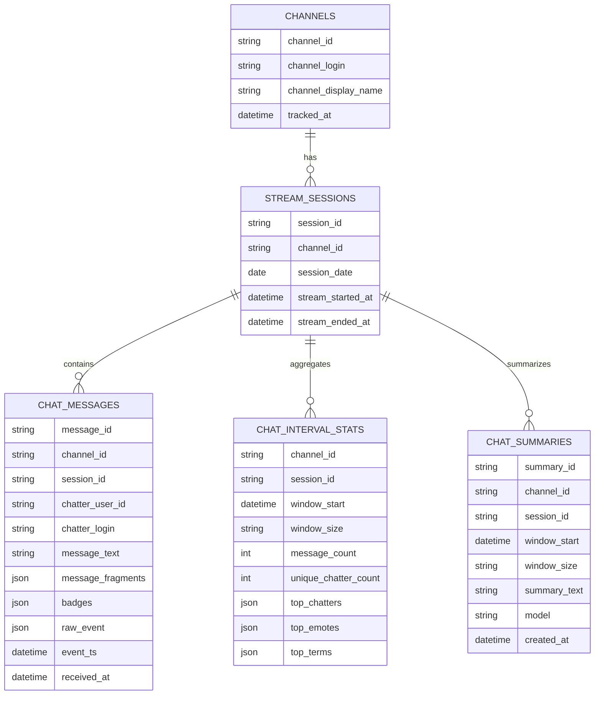

# Project Flow Diagram

## End-to-End Architecture

## Ingestion And Persistence Flow

## Realtime Frontend Flow

## ClickHouse Data Shape

Current implementation writes `chat_messages`. `channels`, `stream_sessions`, `chat_interval_stats`, and `chat_summaries` describe the intended model for later persistence and rollup work.

## Flow Notes

- Kafka is required in the main ingestion path so the project exercises durable streamed-data handling from the beginning.
- ClickHouse is the analytical store for append-only chat events, rollups, and summaries.
- Realtime browser connections are optional. Ingestion and persistence continue even if no React dashboard is open.
- The React dashboard can show all channels together or filter to one channel. It batches live display updates, supports configurable display cadence, and can hide the live feed to reduce browser load.
- Docker Compose persists local ClickHouse data in the `clickhouse-data` named volume.
- Redpanda Console is available at `http://localhost:8080` for Kafka topic, message, offset, and consumer-group inspection.
- The minimal-cost AWS deployment keeps Compose, adds Caddy as the public reverse proxy, and keeps admin/data services private on the host.
- Relational storage is deferred and can later own transactional app metadata without replacing Kafka or ClickHouse.
- Prometheus scrapes backend, worker, and Kafka exporter metrics. Grafana provides the operational dashboard.
